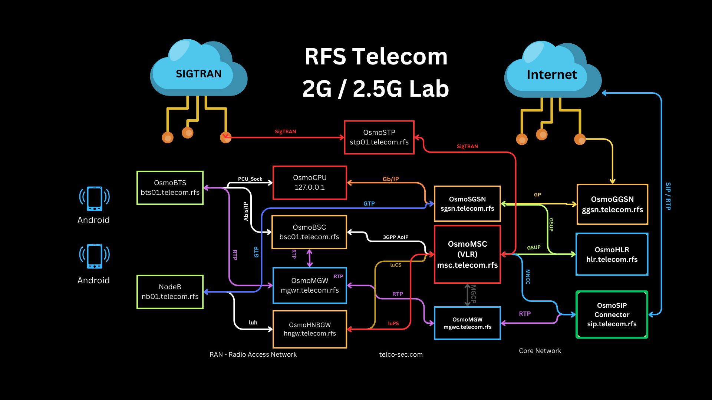
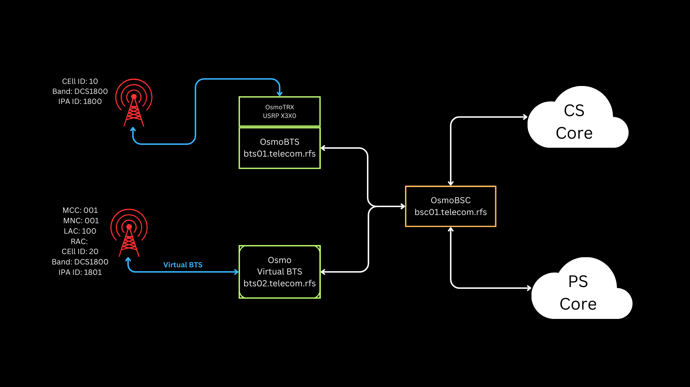

Configure a Osmocom Cellular Network Infrastructure

## RAN

- OsmoBTS - A BTS implementation
- OsmoBSC - GSM Base Station Controller with support for many different BTS vendors and models attached via Abis (over E1 and IP).
- OsmoTRX - A transceiver for OsmoBTS to use with SDR hardware
- OsmoPCU - A packet control unit for GPRS/EDGE enabling the BTS.

## Core
- OsmoMSC - GSM/UMTS Mobile Switching Center with support for AoIP as well as IuCS. SCCPlite support is work in progress.
- OsmoHLR - minimal implementation of a Home Location Register
- OsmoSTP - SS7 Transfer Point to connect MSC and BSC
- OsmoMGW - Media GateWay to relay RTP streams

## GPRS

- OsmoSGSN - A Serving GPRS Support Node
- OsmoGGSN - A Gateway GPRS Support Node

