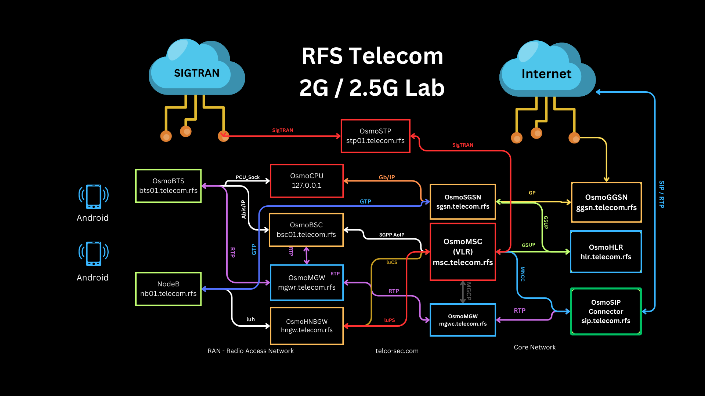

# Osmocom Cellular Network Infrastructure
Configure your Cellular Network Infrastructure

Welcome to the Red Labs Cloud 2G Lab, a unique environment designed for hands-on learning, experimentation, and security testing within a 2G GSM network. This lab empowers you to deepen your understanding of 2G technology, its vulnerabilities, and the broader telecom security landscape.

## Key Features

- Real-World Simulation: Experience a live 2G network with base stations, mobile devices, and core network elements.
- Security Focus: Explore 2G-specific vulnerabilities like man-in-the-middle attacks, eavesdropping, and denial-of-service.
- Open-Source Tools: Utilize Osmocom and Asterisk for network manipulation and analysis.
- Hands-On Learning: Conduct practical exercises on call interception, SMS spoofing, and location tracking.
- DevSecOps Integration: Learn how to automate security testing and integrate security practices into 2G development.
## Benefits

- Enhanced Understanding: Gain a deep understanding of 2G network architecture, protocols, and security challenges.
- Practical Skills: Develop practical skills in penetration testing, vulnerability assessment, and secure development.
- Research and Innovation: Research 2G security, develop new security tools and contribute to the open-source community.
- Telecom Security Expertise: Become an expert in telecom security and contribute to building more secure mobile networks.
## Who Should Use It

- Security researchers
- Telecom engineers
- DevSecOps professionals
- Students and enthusiasts interested in mobile network security

## Projects and Use Cases

- Security Audits: Perform comprehensive security audits of 2G networks.
- Vulnerability Research: Discover and analyze new vulnerabilities in 2G infrastructure and devices.
- Penetration Testing: Conduct penetration tests to assess the security posture of 2G networks.
- Secure Development: Develop secure 2G applications and services.
- Education and Training: Use the lab for educational purposes and hands-on training in telecom security.

## Join the Club

Join the Red Labs Cloud 2G Lab and contribute to a more secure mobile ecosystem. \

Note: This lab is intended for educational and research purposes only. Any illegal activities are strictly prohibited.
